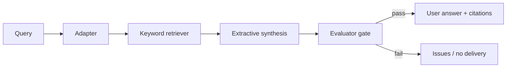

# gate-enforced-rag

A RAG pipeline whose user-facing answer cannot ship until a Meridian-style Evaluator gate passes.

**Status:** Phase 3 — local multi-silo router + contradiction fail-closed

Built on Meridian’s gate + independent Evaluator contracts. Phase 1 is keyword retrieve + extractive citations over one public corpus. Phase 2 adds pipeline-shaped Haystack / LlamaIndex adapters. Phase 3 routes across local `contracts` + `ops` silos and fails closed on claim contradictions. It does not pip-install RAG packages, call an LLM, or scrape Wikipedia / arXiv.

## Relation to Meridian

The Evaluator is a post-generation / pre-delivery component. Corrections memory records rejected answers. Lifecycle hooks (`before_llm` / `before_tool` / `on_exit`) are the intended gate checkpoints.

## Shared contracts

- [GATE_CONTRACT.md](https://github.com/PCSchmidt/portfolio-kit/blob/main/docs/GATE_CONTRACT.md)
- [EVAL_RUBRIC_TEMPLATE.md](https://github.com/PCSchmidt/portfolio-kit/blob/main/docs/EVAL_RUBRIC_TEMPLATE.md)
- [MEMORY_SCHEMA.md](https://github.com/PCSchmidt/portfolio-kit/blob/main/docs/MEMORY_SCHEMA.md)
- [DATA_POLICY.md](https://github.com/PCSchmidt/portfolio-kit/blob/main/docs/DATA_POLICY.md)

## Architecture



Adapters (`mechanical-keyword`, `haystack-adapter`, `llamaindex-adapter`) share retrieve + gate. `--multi-source` merges local silos. Live Haystack / LlamaIndex packages and live Wikipedia / arXiv federation are refused.

## Develop

```sh
npm test
npm run eval
npm run answer -- --haystack fixtures/query-stub.json
npm run answer -- --llamaindex fixtures/query-stub.json
npm run answer -- --multi-source fixtures/query-stub.json
```

Requires Node.js 20+. No dependencies, no network, no GPU. `--llm`, `--openai`, `--live-haystack`, `--pip-haystack`, `--install-haystack`, `--live-llamaindex`, `--pip-llamaindex`, `--install-llamaindex`, `--federated`, `--wikipedia`, `--arxiv`, `--github-write`, `--comment`, and `--issue` are refused. `--haystack` and `--llamaindex` select CI-safe adapters. `--multi-source` is a local router.

## Planned phases

1. Single-source RAG over one public corpus *(shipped; includes shipped; CI-safe)*
3. Multi-source router + contradiction resolution *(this increment; local silos)*ore delivery *(this increment; CI-safe)*
3. Multi-source router + contradiction resolution
4. Observability + federated eval set
5. Optional expose as a dsh tool / plugin

## Public / unclassified data only

No JPO / F-35 / internal document dumps. Cite sources in `fixtures/SOURCES.md` when added.

## Current tree

```
CONTRACT.md
SPEC.md
src/answer.js
src/aouter.js
src/rdapters.js
src/retrieve.js
src/corpus.js
eval/cases.json
fixtures/corpus/
tests/
```
