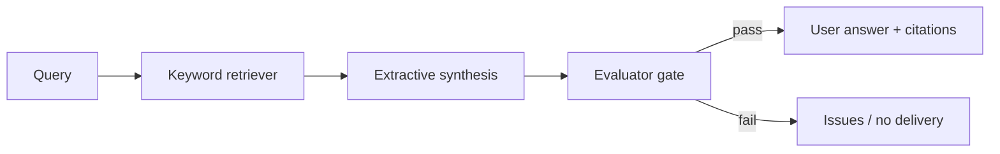

# gate-enforced-rag

A RAG pipeline whose user-facing answer cannot ship until a Meridian-style Evaluator gate passes.

**Status:** Phase 1 — mechanical single-source RAG

Built on Meridian’s gate + independent Evaluator contracts. Phase 1 is keyword retrieve + extractive citations over one public corpus. It does not load Haystack, LlamaIndex, or an LLM. Federated synthesis across public silos is Phase 3.

## Relation to Meridian

The Evaluator is a post-generation / pre-delivery component. Corrections memory records rejected answers. Lifecycle hooks (`before_llm` / `before_tool` / `on_exit`) are the intended gate checkpoints.

## Shared contracts

- [GATE_CONTRACT.md](https://github.com/PCSchmidt/portfolio-kit/blob/main/docs/GATE_CONTRACT.md)
- [EVAL_RUBRIC_TEMPLATE.md](https://github.com/PCSchmidt/portfolio-kit/blob/main/docs/EVAL_RUBRIC_TEMPLATE.md)
- [MEMORY_SCHEMA.md](https://github.com/PCSchmidt/portfolio-kit/blob/main/docs/MEMORY_SCHEMA.md)
- [DATA_POLICY.md](https://github.com/PCSchmidt/portfolio-kit/blob/main/docs/DATA_POLICY.md)

## Architecture



Phase 1 uses a mechanical proxy for `R`/`Syn` (keyword overlap + cited snippets). Haystack / LlamaIndex adapters are Phase 2. Public silos (later): satellite / NOTAM fixtures, GSA-style manifests, your public repos, Wikipedia / arXiv.

## Develop

```sh
npm test
npm run eval
npm run answer -- fixtures/query-stub.json
```

Requires Node.js 20+. No dependencies, no network, no GPU. `--llm`, `--openai`, `--haystack`, `--llamaindex`, `--multi-source`, `--federated`, `--github-write`, `--comment`, and `--issue` are refused.

## Planned phases

1. Single-source RAG over one public corpus *(this increment; includes the Evaluator gate)*
2. Haystack / LlamaIndex adapter, still gated before delivery
3. Multi-source router + contradiction resolution
4. Observability + federated eval set
5. Optional expose as a dsh tool / plugin
```
CONTRACT.md
SPEC.md
src/answer.js
src/retrieve.js
src/corpus.js
eval/cases.json
fixtures/corpus/
tests/
```
## Public / unclassified data only

No JPO / F-35 / internal document dumps. Cite sources in `fixtures/SOURCES.md` when added.

## Current tree

Phase 0 is documentation only.
