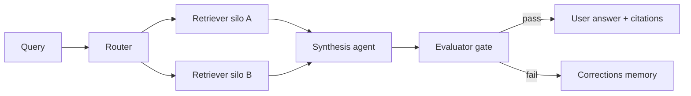

# gate-enforced-rag

A Haystack / LlamaIndex RAG pipeline whose user-facing answer cannot ship until a Meridian-style Evaluator gate passes.

**Status:** Scaffolding – Phase 0

Built on Meridian’s gate + independent Evaluator contracts. Optional second stage: federated synthesis across public silos with contradiction resolution.

## Relation to Meridian

The Evaluator is a post-generation / pre-delivery component. Corrections memory records rejected answers. Lifecycle hooks (`before_llm` / `before_tool` / `on_exit`) are the intended gate checkpoints.

## Shared contracts

- [GATE_CONTRACT.md](https://github.com/PCSchmidt/portfolio-kit/blob/main/docs/GATE_CONTRACT.md)
- [EVAL_RUBRIC_TEMPLATE.md](https://github.com/PCSchmidt/portfolio-kit/blob/main/docs/EVAL_RUBRIC_TEMPLATE.md)
- [MEMORY_SCHEMA.md](https://github.com/PCSchmidt/portfolio-kit/blob/main/docs/MEMORY_SCHEMA.md)
- [DATA_POLICY.md](https://github.com/PCSchmidt/portfolio-kit/blob/main/docs/DATA_POLICY.md)

## Architecture

Public silos (later): satellite / NOTAM fixtures, GSA-style manifests, your public repos, Wikipedia / arXiv.

## Planned phases

1. Single-source RAG over one public corpus
2. Evaluator gate before delivery
3. Multi-source router + contradiction resolution
4. Observability + federated eval set
5. Optional expose as a dsh tool / plugin

## Public / unclassified data only

No JPO / F-35 / internal document dumps. Cite sources in `fixtures/SOURCES.md` when added.

## Current tree

Phase 0 is documentation only.
